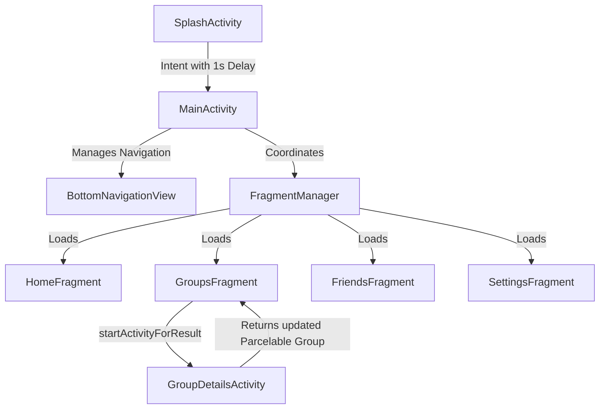

# Budget Babu

[](https://developer.android.com/)
[](https://gradle.org/)
[](https://www.oracle.com/java/)
[](#android-architecture)

A modern Android application for personal expense tracking and group bill splitting built with Java, Material Design, and Android Fragments.

**Budget Babu** is a lightweight, high-performance Android financial management application designed to solve two core challenges: tracking individual daily expenses and managing shared group expenses with friends. 

Built with a native Java codebase targeting Android 14 (API 34), Budget Babu delivers a responsive and immersive user experience via a custom Material Design 3 dark-themed interface. The application features a Single-Activity framework using Android Fragments to coordinate state changes efficiently, a dynamic bill-splitting engine supporting equal and custom breakdowns, and real-time net debt calculations.

---

## Project Overview

As a modern portfolio project, Budget Babu demonstrates clean engineering principles, structural optimization, and user-centric design:
*   **Clean Architecture & UI Modularity**: Implements a Single-Activity pattern, leveraging `FragmentManager` to handle lightweight, lifecycle-aware Fragments (`HomeFragment`, `GroupsFragment`, `FriendsFragment`, `SettingsFragment`).
*   **Dynamic Debt Calculation Algorithm**: Incorporates a balance resolution engine that aggregates splits across multiple groups to compute a net "Who owes Whom" ledger in real time.
*   **Custom Split & Input Validation**: Features custom mathematical validation that ensures custom-defined group splits sum up to exactly 100% of the transaction value before saving.
*   **Material 3 Custom Dark Theme**: Bypasses basic style presets to implement a customized theme palette (`Theme.MaterialComponents.DayNight.NoActionBar`) featuring dark surface variables, rounded shapes (8dp/12dp/16dp configurations), and custom component animations.

---

## Key Features

*   **Individual Expense Ledger**: Log personal transactions with amount, category (Travel, Food, Leisure, Miscellaneous), currency selection, notes, and automatically captured timestamps.
*   **Dynamic Group Management**: Create custom groups, add members, and manage shared expenses efficiently.
*   **Advanced Bill Splitting Engine**:
    *   **Equal Split**: Automatically divides bills equally among all group members.
    *   **Custom Split**: Empower users to input absolute amounts for each member. Includes a real-time validation check to verify that individual allocations match the total amount.
*   **Automated Balance Sheet**: Live calculations displaying net balances. Friends who owe the user are displayed in green (`+₹`), and friends whom the user owes are shown in red (`-₹`).
*   **Immersive Dark UI Theme**: Features an eye-strain reducing dark-mode design built with modern color variables and typography.
*   **App Preferences**:
    *   **Currency Preference Toggle**: Cycle default currency through $, €, £, ₹.
    *   **System-wide Theme Configuration**: Day/Night Theme toggle.
    *   **Email Notification**: Preference setting.

---

## Technology Stack

*   **Language**: Java 8 (source & target compatibility `JavaVersion.VERSION_1_8`)
*   **Target SDK**: Android 14 (API 34) | **Min SDK**: API 25
*   **UI Layouts**: Android XML (using ConstraintLayout, CoordinatorLayout, ScrollView, FrameLayout)
*   **Navigation Components**: `BottomNavigationView`, `FragmentManager` FragmentTransactions
*   **UI Elements**: `RecyclerView`, `BottomSheetDialog`, Material `CardView`, `ExtendedFloatingActionButton`, Custom Dialogs
*   **Theme & Styling**: Material Design Components (MDC), custom shapes and dimensions
*   **Data Storage**: In-Memory runtime collections (`ArrayList`, `HashMap`) and Persistent `SharedPreferences` for settings
*   **Build System**: Gradle Kotlin DSL (`build.gradle.kts`) with Version Catalog (`libs.versions.toml`)

---

## Android Architecture

Budget Babu leverages a structured **Single Activity Architecture**:



*   **Coordinator**: `MainActivity.java` acts as the navigation hub, managing the `BottomNavigationView` and coordinating fragment transactions. It maintains the master list of `Expense` and `Group` objects as in-memory data tables.
*   **Views (Fragments & Activities)**:
    *   `SplashActivity`: A startup splash screen with a 1-second transition handler.
    *   `HomeFragment`: Renders personal expenses in a linear RecyclerView with empty state visibility handling.
    *   `GroupsFragment`: Handles group listings and launches new group creation dialogs.
    *   `GroupDetailsActivity`: A dedicated sub-activity launched via `startActivityForResult()`. It receives a `Group` instance via `Parcelable` serialization, manages group member listings (displayed via horizontal circular initials with randomized colors), handles adding new expenses, and returns the modified `Group` state back to `GroupsFragment`.
    *   `FriendsFragment`: Dynamically parses group lists and aggregates debt structures.
    *   `SettingsFragment`: Modifies user parameters and handles system-wide dark mode updates via `AppCompatDelegate.setDefaultNightMode`.
*   **Data Models (Parcelable & Domain)**:
    *   `Expense.java`: Represents individual transaction records.
    *   `Group.java` (Parcelable): Bundles group metadata, friends list, and expense history for transition passing.
    *   `GroupExpense.java` (Parcelable): Models transactional breakdowns, paid-by attributes, and member splits.

---

## Folder Structure

```
Budget-Babu/
├── app/
│   ├── build.gradle.kts           # App-level build configurations
│   └── src/
│       ├── main/
│       │   ├── AndroidManifest.xml # Entry activities and intent-filters
│       │   ├── java/com/example/madapp/
│       │   │   ├── MainActivity.java
│       │   │   ├── SplashActivity.java
│       │   │   ├── GroupDetailsActivity.java
│       │   │   ├── HomeFragment.java
│       │   │   ├── GroupsFragment.java
│       │   │   ├── FriendsFragment.java
│       │   │   ├── SettingsFragment.java
│       │   │   ├── Expense.java
│       │   │   ├── ExpenseAdapter.java
│       │   │   ├── Group.java
│       │   │   └── GroupExpense.java
│       │   └── res/
│       │       ├── layout/        # Layout XML files (Dialogs, Items, Fragments, Activities)
│       │       ├── menu/          # bottom_nav_menu.xml
│       │       └── values/        # themes.xml, colors.xml, strings.xml, arrays.xml
│       └── test/java/com/example/madapp/
│           └── ExampleUnitTest.java
├── gradle/
│   └── libs.versions.toml         # Centralized dependency declaration
├── build.gradle.kts               # Project-level build configurations
└── settings.gradle.kts            # Project structural declarations
```

---

## Database / Storage Layer

Budget Babu splits its storage architecture into runtime transactions and configuration parameters:

1.  **Runtime In-Memory Transactions**: 
    To optimize memory footprint and ensure instantaneous UI updates, lists of `expenses` and `groups` are held in the application's runtime memory space (`ArrayList<Expense>` and `ArrayList<Group>` inside `MainActivity`). Data state updates are passed between fragments through host-activity accessors (`((MainActivity) requireActivity()).getGroups()`).
2.  **Configuration Persistence (`SharedPreferences`)**:
    App settings (default currency symbol, email notifications toggle, and dark-mode setting) are persisted inside a local XML file via `SharedPreferences` (named `"MadAppPreferences"`). This ensures settings like Dark Mode (`AppCompatDelegate.MODE_NIGHT_YES`) persist across app restarts.

---

## UI Screens and User Flow

```
[Splash Screen] 
      │
      ▼ (1-second delay)
[Home Dashboard] ◄──────► [Groups Hub] ◄──────► [Friends Ledger] ◄──────► [Settings Page]
      │                        │
      ├─► (FAB Add Expense)    ├─► (FAB Create Group)
      │   [BottomSheetDialog]  │   [Dialog Interface]
      │                        │
                               ▼ (Click Group Card)
                       [Group Details]
                               │
                               ├─► (FAB Add Expense)
                               │   [Equal / Custom Split Dialog]
```

1.  **Launch & Transition**: `SplashActivity` exhibits the logo and transitions to the main hub.
2.  **Dashboard (Home)**: View personal transactions list. Click the **Add Expense** FAB to open a bottom-sheet modal to add new items.
3.  **Groups Hub**: Create a group via dynamic text inputs, add friends, and click a group card to open details.
4.  **Group Detail View**: Displays circular avatars for friends (dynamic color assignment), displays transaction list, and features a FAB to add shared expenses with Equal or Custom split configurations.
5.  **Friends Balance Ledger**: Computes split structures across groups to output net balances.
6.  **Preferences (Settings)**: Adjust currency configurations, toggle notifications, or trigger dark mode immediately.

---

## Installation Guide

To install and build this project locally, ensure you have the latest version of Android Studio installed:

1.  Clone the repository:
    ```bash
    git clone https://github.com/Hurshvardhan26/Budget-Babu.git
    cd Budget-Babu
    ```
2.  Open **Android Studio**.
3.  Select **File > Open** and choose the `Budget-Babu` directory.
4.  Wait for Gradle to sync dependencies.

---

## How to Run the Application

1.  Enable developer options and USB debugging on your Android device, or set up an Android Virtual Device (AVD) emulator.
2.  Select the run configuration dropdown next to the green play button and ensure `app` is selected.
3.  Click the **Run** button (or press `Shift + F10`) to build the project and deploy it onto your target device.

---

## Dependencies Used

Defined using Version Catalogs (`gradle/libs.versions.toml`) to ensure clean dependency declaration:

*   `androidx.appcompat:appcompat:1.6.1`: Essential for backwards compatibility of UI controls and themes.
*   `com.google.android.material:material:1.11.0`: Rich UI components including bottom navigation tabs, bottom sheet dialogs, text input styling, cards, and float action buttons.
*   `androidx.constraintlayout:constraintlayout:2.1.4`: High-performance, flat view hierarchies.
*   `androidx.activity:activity:1.8.2`: Integrated lifecycle management utilities.

---

## Challenges Solved

*   **Dynamic Multi-User Split Verification**: Designing a custom split validator that parses dynamically added views in a ScrollView, sums up values, and checks floating-point equality (`Math.abs(total - amount) > 0.01`) before updating model states.
*   **State Syncing between Activities**: Handling modification of group records in a sub-activity (`GroupDetailsActivity`) and reflecting changes back inside a view-pager/tab fragment structure without reloading the parent. Solved by implementing `startActivityForResult()` coupled with `Parcelable` serialization to transport state changes back, which are then integrated using adapter notifications (`notifyItemChanged`).
*   **Material Dark Mode Color Contrast**: Preventing text rendering issues under dark styles. Solved by defining structural layout themes overriding defaults (e.g. overriding `textColor` and `textColorPrimary` inside `Theme.MadApp.Dialog` and setting customized spinner adapters with dynamic `setTextColor` overrides).

---

## Learning Outcomes

*   **Fragment Lifecycle Management**: Managing fragment states dynamically and avoiding memory leaks during parent/child activity navigation.
*   **UI Modularity & Layout Design**: Deepened knowledge in Material Design guidelines, dark-theme layout hierarchies, and dynamic layout inflation via programmatically created elements.
*   **Serialization (Parcelable)**: Handled complex object graphs containing nested collections (`List<GroupExpense>` and `Map<String, Double>`) via custom Parcelable implementations.

---

## Future Improvements

*   **Database Persistence**: Migrating in-memory state objects to an Android Room Database to persist history across restarts.
*   **REST API Syncing / Cloud Storage**: Synchronizing data via REST APIs or Firebase to support cross-device sync.
*   **Detailed Analytics & Visualization**: Adding charts (e.g., MPAndroidChart) to visualize category breakdowns.
*   **Currency Conversion**: Integrating an online Exchange Rate API for cross-currency settling.

---

## Author

*   **Hurshvardhan Rao**
*   GitHub Profile: [@Hurshvardhan26](https://github.com/Hurshvardhan26)

---

